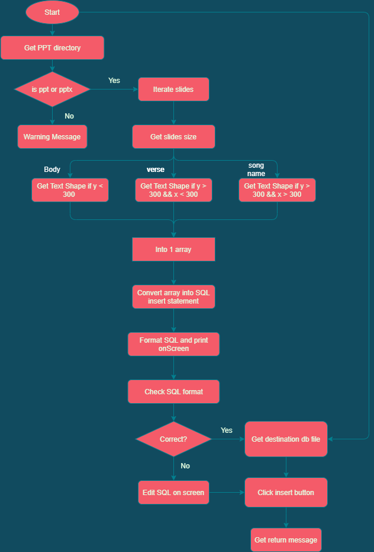

# PPTConverter
## Intro
> A desktop app that can convert ppt slides into sql statement and insert into local storage, will target the .db extension.

## Program design flow chart


## slides format


## condition for lower:
> shape y axis bottom > 350 and
> not a paragraph indicator and
> content is not empty and
> shape x axis right < 300


## condition for upper:
> shape y axis bottom < 140 and
> not a paragraph indicator and
> content is not empty


## Sample Command
```
convert C:\Users\abc\Downloads\20211010.pptx lower C:\Users\abc\Documents\EasyslidesData\Admin\Databases\Worship_service.db
```